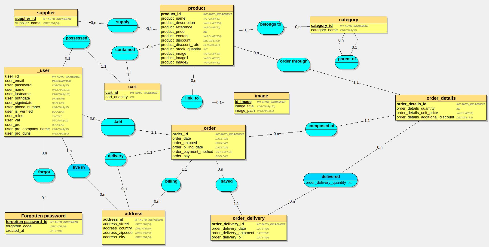

# Dictionnaire de données

## Table User
Codification | Type | Contraintes | Règles
---------|----------| ----------- | -----
 user_id | INT AUTO_INCREMENT  | PRIMARY KEY
 user_email | VARCHAR(150)
 user_password | VARCHAR(50)
 user_name | VARCHAR(100)
 user_lastname | VARCHAR(100)
 user_birthdate | DATETIME
 user_signupdate | DATETIME
 | |
 user_phone_number | VARCHAR(30)
 user_is_verified | BOOLEAN
 user_roles | TINYINT UNSIGNED
 user_vat | DECIMAL(4,2) 
 | |
 user_pro | BOOLEAN
 user_pro_company_name | VARCHAR(50) 
 user_pro_duns | VARCHAR(50) | | DUNS = SIRET international (Data universal number system) 

 ## TABLE Forgotten password
Codification | Type | Contraintes | Règles
---------|----------| ----------- | -----
 forgotten password_id | INT AUTO_INCREMENT | PRIMARY KEY
 forgotten_code | VARCHAR(16)
 created_at | DATETIME
 user_id | INT UNIQUE NOT NULL | REFERENCES user(user_id)


## Table Supplier
Codification | Type | Contraintes | Règles
---------|----------| ----------- | -----
 supplier_id | INT AUTO_INCREMENT | PRIMARY KEY
 supplier_name | VARCHAR(50)


## Table Category
Codification | Type | Contraintes | Règles
---------|----------| ----------- | -----
 category_id | INT AUTO_INCREMENT | PRIMARY KEY
 category_parent_id | INT | REFERENCES category(category_id)
 category_name | VARCHAR(50)


## Table Address
Codification | Type | Contraintes | Règles
---------|----------| ----------- | -----
 address_id | INT AUTO_INCREMENT | PRIMARY KEY
 address_street | VARCHAR(50)
 address_country VARCHAR(50)
 address_zipcode VARCHAR(50)
 address_city VARCHAR(50)
 address_user_id | INT | REFERENCES user(user_id)


## Table Product
Codification | Type | Contraintes | Règles
---------|----------| ----------- | -----
 product_id | INT AUTO_INCREMENT  | PRIMARY KEY
 product_supplier_id | INT  | REFERENCES supplier(supplier_id)
 product_category_id | INT |  REFERENCES category(category_id)
 product_name | VARCHAR(50) | | Ne pas oublier la brand dans le nom
 product_description | VARCHAR(150)
 product_price | DECIMAL(8,2) NOT NULL
 product_discount | DECIMAL(3,2)
 product_discount_rate | DECIMAL(8,2)
 product_stock_quantity | INT | > 0 


## Table Order
Codification | Type | Contraintes | Règles
---------|----------| ----------- | -----
 order_id | INT AUTO_INCREMENT | PRIMARY KEY
 order_user_id | INT | REFERENCES user(user_id)
 order_billing_address_id | INT |  REFERENCES address(address_id)
 order_delivery_address_id | INT |  REFERENCES address(address_id)
 order_date | DATETIME
 order_shipped | BOOLEAN
 order_billing_date | DATETIME
 order_payment_method | VARCHAR(50)
 order_pay | BOOLEAN

## Table Order_Details
Codification | Type | Contraintes | Règles
---------|----------| ----------- | -----
 order_details_id | INT AUTO_INCREMENT | PRIMARY KEY
 order_details_product_id | INT | REFERENCES product(product_id)
 order_details_order_id | INT | REFERENCES order(order_id)
 order_details_quantity | INT NOT NULL | > 0
 order_details_unit_price | DOUBLE NOT NULL | > 0
 order_details_optional_discount | DECIMAL(3,2) | | Pour les commerciaux


## Table order_delivery
Codification | Type | Contraintes | Règles
---------|----------| ----------- | -----
 order_delivery_id | INT AUTO_INCREMENT | PRIMARY KEY
 order_delivery_order_details_id | INT  | REFERENCES order(order_id)
 order_delivery_date | DATETIME
 order_delivery_shipment | DATETIME
 order_delivery_bill| DATETIMEE


## TABLE Cart
Codification | Type | Contraintes | Règles
---------|----------| ----------- | -----
 cart_id | INT AUTO_INCREMENT | PRIMARY KEY
 cart_quantity | INT
 cart_user_id | INT UNIQUE NOT NULL | REFERENCES user(user_id)


## TABLE Image
Codification | Type | Contraintes | Règles
---------|----------| ----------- | -----
 image_id | INT AUTO_INCREMENT | PRIMARY KEY
 image_title | VARCHAR(150)
 image_path | VARCHAR(150)
 image_product_id | INT | REFERENCE product(product_id)


## TABLE Live_In
Codification | Type | Contraintes | Règles
---------|----------| ----------- | -----
 live_in_user_id | INT | PRIMARY KEY REFERENCE user(user_id)
 live_in_address | INT | PRIMARY KEY REFERENCE adress(address_id)


## TABLE Delivered
Codification | Type | Contraintes | Règles
---------|----------| ----------- | -----
 delivered_order_details_id | INT | PRIMARY KEY REFERENCE order_details(order_details_id)
 delivered_order_delivery_id | INT | PRIMARY KEY REFERENCE order_delivery(order_delivery_id)
 delivered_quantity | INT


## TABLE Contained
Codification | Type | Contraintes | Règles
---------|----------| ----------- | -----
contained_product_id | INT | PRIMARY KEY REFERENCE product(product_id)
contained_cart_id | INT | PRIMARY KEY REFERENCE cart(cart_id)


# MCD



# MLD
```sql
user = (user_id INT AUTO_INCREMENT, user_email VARCHAR(150), user_password VARCHAR(50), user_name VARCHAR(100), user_lastname VARCHAR(100), user_birthdate DATETIME, user_signindate DATETIME, user_phone_number VARCHAR(30), user_is_verified BOOLEAN, user_roles TINYINT, user_vat DECIMAL(4,2), user_pro BOOLEAN, user_pro_company_name VARCHAR(50), user_pro_duns VARCHAR(50) );


supplier = (supplier_id INT AUTO_INCREMENT, supplier_name VARCHAR(50) );


category = (category_id INT AUTO_INCREMENT, category_name VARCHAR(50), #category_parent_id*);


address = (address_id INT AUTO_INCREMENT, address_street VARCHAR(50), address_country VARCHAR(50), address_zipcode VARCHAR(50), address_city VARCHAR(50) );


cart = (cart_id INT AUTO_INCREMENT, cart_quantity INT, #cart_user_id);


product = (product_id INT AUTO_INCREMENT, product_name VARCHAR(50), product_description VARCHAR(150), product_reference VARCHAR(50), product_price DECIMAL(8,2), product_discount DECIMAL(3,2), product_discount_rate DECIMAL(8,2), product_stock_quantity INT, #product_category_id*, #product_supplier_id*);


order = (order_id INT AUTO_INCREMENT, order_date DATETIME, order_shipped BOOLEAN, order_billing_date DATETIME, order_payment_method VARCHAR(50), order_pay BOOLEAN, #order_delivery_address_id, #order_billing_address_id, #order_user_id);


order_details = (order_details_id INT AUTO_INCREMENT, order_details_quantity INT, order_details_unit_price VARCHAR(50), order_details_additional_discount DECIMAL(3,2), #order_details_order_id, #order_details_product_id);


order_delivery = (order_delivery_id INT AUTO_INCREMENT, order_delivery_date DATETIME, order_delivery_shipment DATETIME, order_delivery_bill DATETIME, #order_delivery_order_id);


image = (image_id INT AUTO_INCREMENT, image_title VARCHAR(150), image_path VARCHAR(150), #image_product_id*);


live_in = (#live_in_user_id, #live_in_address_id);


delivered = (#delivered_order_details_id, #delivered_order_delivery_id, delivered_order_delivery_quantity INT);


contained = (#contained_product_id, #contained_cart_id);
```


# Script SQL
```sql
DROP DATABASE IF EXISTS greenvillage;
CREATE DATABASE greenvillage;

USE greenvillage;

CREATE TABLE user(
   user_id INT AUTO_INCREMENT,
   user_email VARCHAR(150)  NOT NULL,
   user_password VARCHAR(50) ,
   user_name VARCHAR(100) ,
   user_lastname VARCHAR(100) ,
   user_birthdate DATETIME,
   user_signindate DATETIME,
   user_phone_number VARCHAR(30) ,
   user_is_verified BOOLEAN,
   user_roles TINYINT UNSIGNED,
   user_vat DECIMAL(4,2)  ,
   user_pro BOOLEAN,
   user_pro_company_name VARCHAR(50) ,
   user_pro_duns VARCHAR(50) ,
   PRIMARY KEY(user_id)
);

CREATE TABLE Forgotten_password(
   forgotten_password_id INT AUTO_INCREMENT,
   forgotten_code VARCHAR(16) ,
   created_at DATETIME,
   user_id INT,
   PRIMARY KEY(forgotten_password_id),
   FOREIGN KEY(user_id) REFERENCES _user(user_id)
);

CREATE TABLE supplier(
   supplier_id INT AUTO_INCREMENT,
   supplier_name VARCHAR(50) ,
   PRIMARY KEY(supplier_id)
);

CREATE TABLE category(
   category_id INT AUTO_INCREMENT,
   category_name VARCHAR(50) ,
   category_parent_id INT,
   PRIMARY KEY(category_id),
   FOREIGN KEY(category_parent_id) REFERENCES category(category_id)
);

CREATE TABLE address(
   address_id INT AUTO_INCREMENT,
   address_street VARCHAR(50) ,
   address_country VARCHAR(50) ,
   address_zipcode VARCHAR(50) ,
   address_city VARCHAR(50) ,
   PRIMARY KEY(address_id)
);

CREATE TABLE cart(
   cart_id INT AUTO_INCREMENT,
   cart_quantity INT,
   cart_user_id INT NOT NULL,
   PRIMARY KEY(cart_id),
   UNIQUE(cart_user_id),
   FOREIGN KEY(cart_user_id) REFERENCES user(user_id)
);

CREATE TABLE product(
   product_id INT AUTO_INCREMENT,
   product_name VARCHAR(50) ,
   product_description VARCHAR(150) ,
   product_reference VARCHAR(50) ,
   product_price DECIMAL(8,2) NOT NULL,
   product_discount DECIMAL(3,2)  ,
   product_discount_rate DECIMAL(8,2)  ,
   product_stock_quantity INT,
   product_category_id INT,
   product_supplier_id INT,
   PRIMARY KEY(product_id),
   FOREIGN KEY(product_category_id) REFERENCES category(category_id),
   FOREIGN KEY(product_supplier_id) REFERENCES supplier(supplier_id)
);

CREATE TABLE `order`(
   order_id INT AUTO_INCREMENT,
   order_date DATETIME,
   order_shipped BOOLEAN,
   order_billing_date DATETIME,
   order_payment_method VARCHAR(50) ,
   order_pay BOOLEAN,
   order_billing_address_id INT NOT NULL,
   order_delivery_address_id INT NOT NULL,
   order_user_id INT NOT NULL,
   PRIMARY KEY(order_id),
   FOREIGN KEY(order_billing_address_id) REFERENCES address(address_id),
   FOREIGN KEY(order_delivery_address_id) REFERENCES address(address_id),
   FOREIGN KEY(order_user_id) REFERENCES user(user_id)
);

CREATE TABLE order_details(
   order_details_id INT AUTO_INCREMENT,
   order_details_quantity INT NOT NULL,
   order_details_unit_price VARCHAR(50) ,
   order_details_additional_discount DECIMAL(3,2)  ,
   order_details_order_id INT NOT NULL,
   order_details_product_id INT NOT NULL,
   PRIMARY KEY(order_details_id),
   FOREIGN KEY(order_details_order_id) REFERENCES `order`(order_id),
   FOREIGN KEY(order_details_product_id) REFERENCES product(product_id)
);

CREATE TABLE order_delivery(
   order_delivery_id INT AUTO_INCREMENT,
   order_delivery_date DATETIME,
   order_delivery_shipment DATETIME,
   order_delivery_bill DATETIME,
   order_delivery_order_id INT NOT NULL,
   PRIMARY KEY(order_delivery_id),
   FOREIGN KEY(order_delivery_order_id) REFERENCES `order`(order_id)
);

CREATE TABLE image(
   image_id INT AUTO_INCREMENT,
   image_title VARCHAR(150) ,
   image_path VARCHAR(150) ,
   image_product_id INT,
   PRIMARY KEY(image_id),
   FOREIGN KEY(image_product_id) REFERENCES product(product_id)
);

CREATE TABLE live_in(
   live_in_user_id INT,
   live_in_address_id INT,
   PRIMARY KEY(live_in_user_id, live_in_address_id),
   FOREIGN KEY(live_in_user_id) REFERENCES user(user_id),
   FOREIGN KEY(live_in_address_id) REFERENCES address(address_id)
);

CREATE TABLE delivered(
   delivered_order_details_id INT,
   delivered_order_delivery_id INT,
   delivered_order_delivery_quantity INT,
   PRIMARY KEY(delivered_order_details_id, delivered_order_delivery_id),
   FOREIGN KEY(delivered_order_details_id) REFERENCES order_details(order_details_id),
   FOREIGN KEY(delivered_order_delivery_id) REFERENCES order_delivery(order_delivery_id)
);

CREATE TABLE contained(
   contained_product_id INT,
   contained_cart_id INT,
   PRIMARY KEY(contained_product_id, contained_cart_id),
   FOREIGN KEY(contained_product_id) REFERENCES product(product_id),
   FOREIGN KEY(contained_cart_id) REFERENCES cart(cart_id)
);
```
